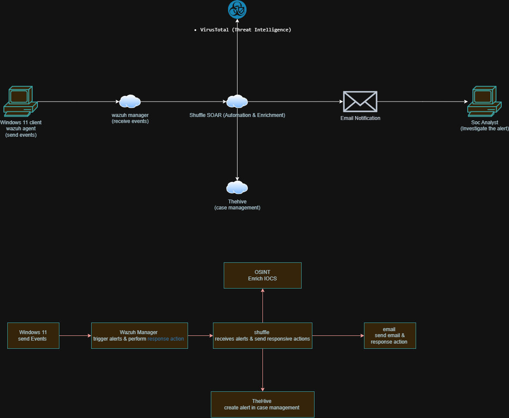

# soc-soar-automation
SOC automation using Wazuh, Shuffle SOAR, VirusTotal, and TheHive for alert enrichment and incident response.
---

##  Objective

The objective of this project is to design and implement an automated Security Operations Center (SOC) workflow using SOAR principles to enhance threat detection, alert enrichment, and incident response efficiency.

This project integrates multiple security tools including Wazuh (SIEM), Shuffle (SOAR), VirusTotal (Threat Intelligence), and TheHive (Case Management) to simulate a real-world SOC environment. It focuses on reducing manual effort by automating repetitive tasks such as alert triage, threat intelligence lookups, case creation, and analyst notification.

Additionally, the project demonstrates how security alerts can be enriched with contextual threat intelligence and escalated through automated workflows, enabling faster decision-making and improved response time for security incidents.

---

##  Architecture

Wazuh → Shuffle → VirusTotal → TheHive

##  SOC Automation Architecture

  

##  Tools Used

- Wazuh (SIEM & Alert Detection)
- Shuffle (SOAR Automation)
- VirusTotal (Threat Intelligence)
- TheHive (Incident Response & Case Management)

---

##  Workflow

1. Wazuh generates a security alert  
2. Alert is sent to Shuffle via webhook  
3. Shuffle extracts file hash from alert  
4. Hash is sent to VirusTotal for analysis  
5. If malicious:
   - Shuffle creates a case in TheHive  
   - Alert is enriched with threat intelligence  
   - Email notification is sent to SOC analyst  
6. SOC analyst investigates and responds  

---

##  Key Features

- Automated alert enrichment  
- Threat intelligence integration  
- Automated incident response  
- Email notification system  
- Reduced manual SOC workload  
- Simulated attack scenarios to validate alert detection and automation workflow  
---

##  Screenshots

- Wazuh Alert  
- Shuffle Workflow
- 

  

- VirusTotal Response

  

- TheHive Case  

  

##  Email Notification

  

---

##  Skills Demonstrated

- SIEM Integration  
- SOAR Automation  
- Threat Intelligence Analysis  
- Incident Response Workflow  
- SOC Operations  

---

##  Note

This project demonstrates a real-world SOC automation pipeline for improving detection and response efficiency.
